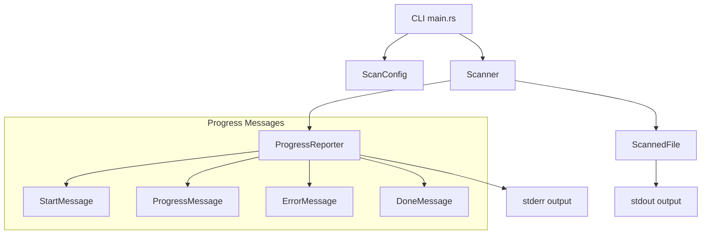
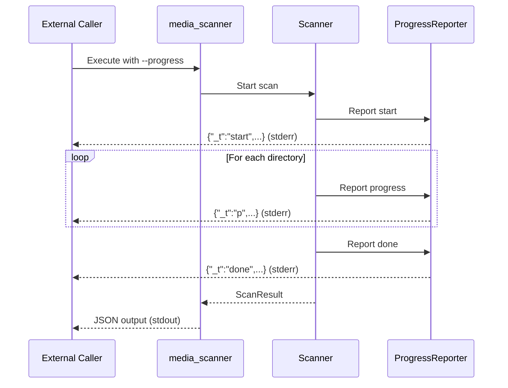

# Design Document: Scan Progress Enhancement

## Overview

本设计文档描述媒体扫描器的进度增强功能实现方案。主要目标是：
1. 将默认行为改为跳过哈希计算，提升扫描速度
2. 增强进度报告机制，为外部调用程序提供更详细、更及时的反馈

## Architecture

### 组件关系图



### 数据流



## Components and Interfaces

### 1. ScanConfig 修改

在 `src/config.rs` 中修改配置结构：

```rust
pub struct ScanConfig {
    // ... existing fields ...
    
    /// Whether to compute file hashes (default: false)
    pub compute_hash: bool,
    
    /// Progress reporting interval in milliseconds (default: 200)
    pub progress_interval_ms: u64,
    
    /// Whether to show progress output to stderr
    pub show_progress: bool,
}

impl Default for ScanConfig {
    fn default() -> Self {
        Self {
            // ... existing defaults ...
            compute_hash: false,  // Changed from true to false
            progress_interval_ms: 200,
            show_progress: false,
        }
    }
}
```

Builder 新增方法：

```rust
impl ScanConfigBuilder {
    /// Set progress reporting interval in milliseconds
    pub fn progress_interval_ms(mut self, interval: u64) -> Self {
        self.config.progress_interval_ms = interval;
        self
    }
}
```

### 2. ProgressReporter 组件

新建 `src/progress.rs` 模块：

```rust
/// Progress reporter for outputting scan progress to stderr
pub struct ProgressReporter {
    /// Whether progress reporting is enabled
    enabled: bool,
    /// Reporting interval in milliseconds
    interval_ms: u64,
    /// Last report time
    last_report: Instant,
    /// Sequence number for messages
    seq: AtomicU64,
    /// Start time
    start_time: Instant,
}

impl ProgressReporter {
    pub fn new(enabled: bool, interval_ms: u64) -> Self;
    pub fn report_start(&self, config: &ScanConfig);
    pub fn report_progress(&self, progress: &ScanProgress) -> bool;
    pub fn report_error(&self, error: &ScanError);
    pub fn report_done(&self, result: &ScanResult);
    pub fn should_report(&self) -> bool;
}
```

### 3. Progress Message Types

```rust
/// Scan phase indicator
#[derive(Debug, Clone, Copy, Serialize)]
#[serde(rename_all = "lowercase")]
pub enum ScanPhase {
    Scan,
    Process,
    Done,
}

/// Start message sent when scan begins
#[derive(Debug, Serialize)]
pub struct StartMessage {
    #[serde(rename = "_t")]
    pub msg_type: &'static str,  // "start"
    pub seq: u64,
    pub ts: u64,  // timestamp in ms
    pub roots: Vec<String>,
    pub recursive: bool,
    pub max_depth: usize,
    pub compute_hash: bool,
}

/// Progress message sent during scan
#[derive(Debug, Serialize)]
pub struct ProgressMessage {
    #[serde(rename = "_t")]
    pub msg_type: &'static str,  // "p"
    pub seq: u64,
    pub ts: u64,
    pub phase: ScanPhase,
    #[serde(rename = "f")]
    pub files: u64,
    #[serde(rename = "d")]
    pub dirs: u64,
    #[serde(rename = "v")]
    pub video_count: u64,
    #[serde(rename = "i")]
    pub image_count: u64,
    #[serde(rename = "a")]
    pub audio_count: u64,
    pub dir: String,
    pub ms: u64,
    #[serde(skip_serializing_if = "Option::is_none")]
    pub eta_ms: Option<u64>,
}

/// Error message sent when an error occurs
#[derive(Debug, Serialize)]
pub struct ErrorProgressMessage {
    #[serde(rename = "_t")]
    pub msg_type: &'static str,  // "err"
    pub seq: u64,
    pub ts: u64,
    pub error_type: String,
    pub message: String,
    #[serde(skip_serializing_if = "Option::is_none")]
    pub path: Option<String>,
}

/// Done message sent when scan completes
#[derive(Debug, Serialize)]
pub struct DoneMessage {
    #[serde(rename = "_t")]
    pub msg_type: &'static str,  // "done"
    pub seq: u64,
    pub ts: u64,
    #[serde(rename = "tf")]
    pub total_files: u64,
    #[serde(rename = "td")]
    pub total_dirs: u64,
    #[serde(rename = "nf")]
    pub new_files: u64,
    #[serde(rename = "mf")]
    pub modified_files: u64,
    #[serde(rename = "df")]
    pub deleted_files: u64,
    #[serde(rename = "ec")]
    pub error_count: usize,
    pub ms: u64,
}
```

### 4. CLI 参数修改

在 `src/main.rs` 中：

```rust
#[derive(Subcommand)]
enum Commands {
    Scan {
        // ... existing args ...
        
        /// 计算文件哈希（默认不计算）
        #[arg(long)]
        hash: bool,
        
        // Remove --no-hash flag
        
        /// 进度报告间隔（毫秒）
        #[arg(long, default_value = "200")]
        progress_interval: u64,
        
        // ... rest of args ...
    },
}
```

## Data Models

### ScanProgress 增强

修改 `src/scanner.rs` 中的 `ScanProgress`：

```rust
#[derive(Debug, Clone, Default)]
pub struct ScanProgress {
    pub scanned_files: u64,
    pub scanned_dirs: u64,
    pub video_count: u64,
    pub image_count: u64,
    pub audio_count: u64,
    pub current_dir: String,
    pub elapsed_ms: u64,
    pub phase: ScanPhase,
    pub estimated_total: Option<u64>,
}

impl ScanProgress {
    /// Calculate estimated remaining time
    pub fn estimated_remaining_ms(&self) -> Option<u64> {
        if self.scanned_files == 0 || self.elapsed_ms == 0 {
            return None;
        }
        self.estimated_total.map(|total| {
            let rate = self.scanned_files as f64 / self.elapsed_ms as f64;
            let remaining = total.saturating_sub(self.scanned_files);
            (remaining as f64 / rate) as u64
        })
    }
}
```

## Correctness Properties

*A property is a characteristic or behavior that should hold true across all valid executions of a system-essentially, a formal statement about what the system should do. Properties serve as the bridge between human-readable specifications and machine-verifiable correctness guarantees.*

### Property 1: Default hash computation disabled

*For any* newly created ScanConfig using default(), the compute_hash field SHALL be false.

**Validates: Requirements 1.1**

### Property 2: Hash field None when disabled

*For any* file scanned with a ScanConfig where compute_hash is false, the resulting ScannedFile SHALL have hash field set to None.

**Validates: Requirements 1.4**

### Property 3: Progress message structure validity

*For any* ProgressMessage output by the ProgressReporter:
- It SHALL be valid JSON
- It SHALL contain `_t` field with value "p"
- It SHALL contain `seq` field with a non-negative integer
- It SHALL contain `ts` field with timestamp in milliseconds
- It SHALL contain `f` (files), `d` (dirs), `v` (video), `i` (image), `a` (audio) count fields
- It SHALL contain `dir` field with current directory path
- It SHALL contain `ms` field with elapsed time
- It SHALL contain `phase` field with value "scan", "process", or "done"

**Validates: Requirements 3.2, 3.4, 4.1, 4.2, 4.3, 4.4, 4.6, 4.7, 5.1, 5.2, 5.5**

### Property 4: Progress interval timing

*For any* sequence of ProgressMessages with progress reporting enabled at interval I, the time difference between consecutive messages SHALL be approximately I milliseconds (within reasonable tolerance for system scheduling).

**Validates: Requirements 2.1**

### Property 5: Sequence number monotonicity

*For any* sequence of messages (start, progress, error, done) output by a single ProgressReporter instance, the seq field SHALL be strictly monotonically increasing.

**Validates: Requirements 5.3**

### Property 6: Start message structure

*For any* StartMessage output by the ProgressReporter:
- It SHALL contain `_t` field with value "start"
- It SHALL contain `roots` array with scan root paths
- It SHALL contain `recursive` boolean field
- It SHALL contain `max_depth` integer field
- It SHALL contain `compute_hash` boolean field

**Validates: Requirements 6.2**

### Property 7: Done message structure

*For any* DoneMessage output by the ProgressReporter:
- It SHALL contain `_t` field with value "done"
- It SHALL contain `tf` (total files), `td` (total dirs) count fields
- It SHALL contain `nf` (new), `mf` (modified), `df` (deleted) count fields
- It SHALL contain `ec` (error count) field
- It SHALL contain `ms` (duration) field

**Validates: Requirements 6.4**

### Property 8: Error message structure

*For any* ErrorProgressMessage output by the ProgressReporter:
- It SHALL contain `_t` field with value "err"
- It SHALL contain `error_type` string field
- It SHALL contain `message` string field
- It SHALL contain `path` field when the error is associated with a specific path

**Validates: Requirements 7.2, 7.3**

## Error Handling

### 错误类型处理

| 错误类型 | 处理方式 | 进度报告 |
|---------|---------|---------|
| PermissionDenied | 继续扫描，记录错误 | 立即输出 ErrorProgressMessage |
| NotFound | 继续扫描，记录错误 | 立即输出 ErrorProgressMessage |
| IoError | 继续扫描，记录错误 | 立即输出 ErrorProgressMessage |
| DatabaseError | 根据严重程度决定 | 输出 ErrorProgressMessage |

### 错误恢复策略

```rust
impl ProgressReporter {
    pub fn report_error(&self, error: &ScanError) {
        if !self.enabled {
            return;
        }
        
        let msg = ErrorProgressMessage {
            msg_type: "err",
            seq: self.next_seq(),
            ts: self.current_timestamp(),
            error_type: format!("{:?}", error.kind),
            message: error.message.clone(),
            path: error.path.as_ref().map(|p| p.to_string_lossy().to_string()),
        };
        
        self.output_to_stderr(&msg);
    }
}
```

## Testing Strategy

### 单元测试

1. **配置测试**
   - 验证默认配置 compute_hash 为 false
   - 验证 progress_interval_ms 默认值为 200
   - 验证 builder 方法正确设置值

2. **消息结构测试**
   - 验证各类消息的 JSON 序列化格式
   - 验证必需字段存在
   - 验证字段类型正确

3. **ProgressReporter 测试**
   - 验证 should_report() 时间间隔逻辑
   - 验证序列号递增
   - 验证消息输出到 stderr

### 属性测试 (Property-Based Testing)

使用 `proptest` 库进行属性测试：

1. **Property 1 测试**: 生成随机 ScanConfig，验证默认 compute_hash 为 false
2. **Property 2 测试**: 生成随机文件，验证 compute_hash=false 时 hash 为 None
3. **Property 3 测试**: 生成随机 ProgressMessage，验证 JSON 结构
4. **Property 5 测试**: 生成随机消息序列，验证 seq 单调递增
5. **Property 6-8 测试**: 生成随机消息，验证结构完整性

### 集成测试

1. **CLI 测试**
   - 测试 `--hash` 参数启用哈希计算
   - 测试 `--progress-interval` 参数
   - 测试进度输出到 stderr

2. **端到端测试**
   - 创建临时目录结构
   - 运行扫描并捕获 stderr
   - 验证进度消息格式和内容

### 测试配置

```rust
// 属性测试配置
proptest! {
    #![proptest_config(ProptestConfig::with_cases(100))]
    
    #[test]
    fn test_progress_message_structure(msg in arb_progress_message()) {
        // Property 3: Progress message structure validity
        let json = serde_json::to_string(&msg).unwrap();
        let parsed: serde_json::Value = serde_json::from_str(&json).unwrap();
        
        assert_eq!(parsed["_t"], "p");
        assert!(parsed["seq"].is_u64());
        assert!(parsed["ts"].is_u64());
        // ... more assertions
    }
}
```
